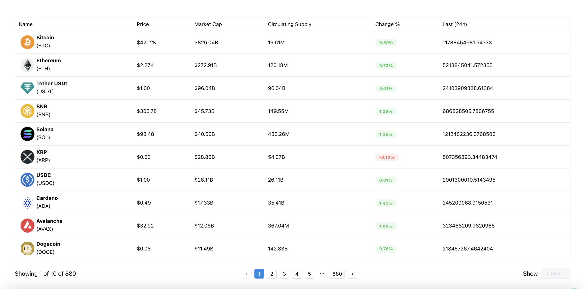

# Seconda Interview Task



# Running
Create a `.env.local` with the following credentials below

Feel free to add your environment. This is a free teir and gets rate limited often

```js
NEXT_API_KEY=44d70180-fe03-41dc-a6e2-b78d07438ef0
```

## Running the app
To run the app execute the following commands

```bash
npm install
npm run dev
```

## Running unit tests
To run the unit test execute the folloeing command below

```
npm test
```

## Additional information / context
- Coinmarketcap api is heavily rate limit in the free teir access key and this affects pagination due to the number of endpoint we hit within a minute
- Ran out of time to implement the following below
 * Search functionality 
 * More extensive unit testing and or cypress e2e tests
 * Proper jsdoc comments with my react componet and helper typescript functions